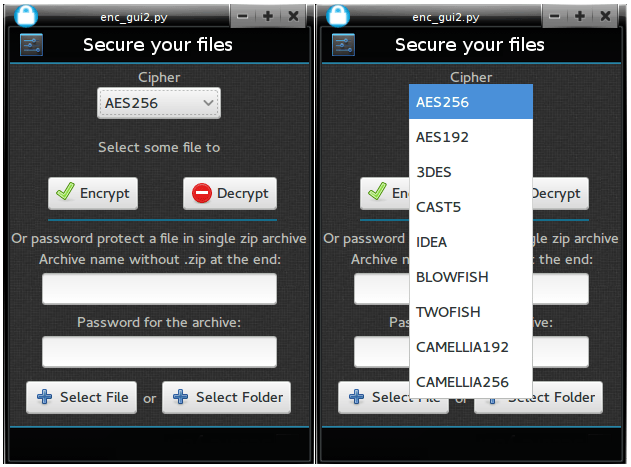

file-encrypter - gui & cli
==============

## cli version 2
 
## cli version 1
 

The purpose of this program is to ease the process from encrypting and decrypting your personal files.
Your are not limited to text files. You can encrypt other programs, archives and so on with this fellow.

## Requirements

* python 
* gpg 

for the gui version:
* python-gobject (for debian is python-gi) -- all of this is known as gtk+ 3
* webkitgtk, pywebkitgtk
* p7zip

## Archlinux support
Archlinux users can install the program directly from AUR, without the need to download it from here.

    yaourt -S file-encrypter-git

## Usage (cli version)
To encrypt single file, let's say "a.txt" .

    python encrypt_decrypt.py e a.txt

To decrypt the encrypted "a.txt" file:

    python encrypt_decrypt.py d a.txt
    
## Usage2 (gui version)

Make the program executable with permissions to read and write. Double click on it and choose between encrypting a file or decrypting.

Thanks to "ssbr, simpson, _habnabit" from the official #python channel who suggested me to replace the openssl version of this program with GPG.