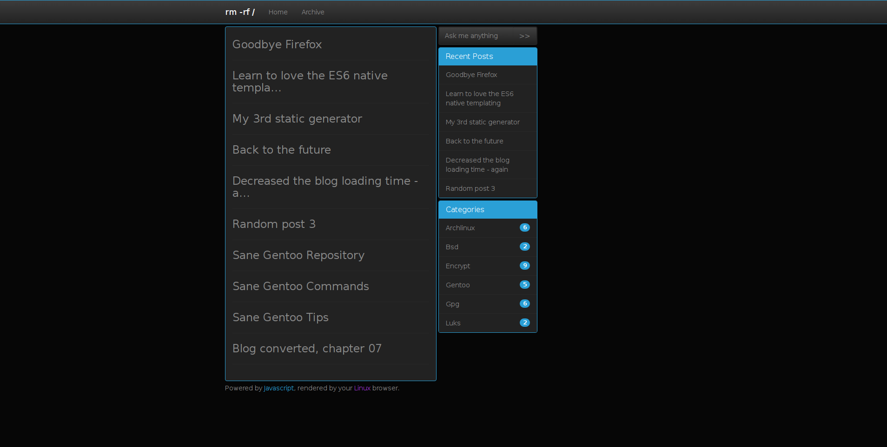
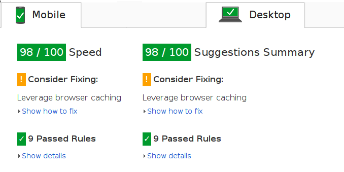
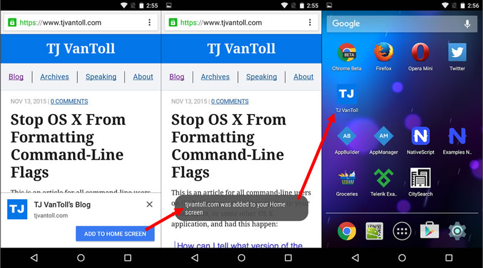

Static Blog For You - [Demo](https://wifiextender.github.io)



The typical static generator behaviour: run some "update" command and wait. Spotted a typo in some post .. repeat the "update" process.

Here comes jblogfy, heavily inspired by geminiBlog, Angular and single page app philosophy.

Out of the box you get:

* Cyborg theme (compiled from source code)
* Interactive search form
* In post code highlighting
* Markdown conversion (only when a blog post is requested)
* Recent Posts and Categories sidebars
* Home and Archive pages
* Operating system detection
* Service Worker caching (offline first)
* RSS feed and sitemap generated by the Service Worker on-the-fly

The blog post conversion happens on the client side (your blog visitor browser).
In 2 simple steps you can update your blog.

Step 1: Write markdown formatted post in the **markdown** directory.

markdown/hello_world.md
```markdown

---

Hello World
```

Step 2: Edit **js/config.js** to include your new post.

```javascript
var metaPool = [

    ["sane_gentoo_tips","Sane Gentoo Tips","May 5, 2016","Gentoo"]
    ["random_post3","Random post 3","May 19, 2016",""],
    [
      "hello_world",   // filename without .md extension
      "Hello World",   // Post Title
      "May 24, 2016",  // Publishing date
      ""               // Categories "1,2,3,4,5"
    ]

];
```

Refresh your blog page and you'll see the new post.
Spotted a typo in some post - fix it and refresh the blog page.

Note that when a post is requested (link clicked), once it's parsed and converted it will be stored in the browser localStorage for next two days.

If you experiment with the source code make sure to clear the localStorage so you can preview your post changes. In the browser console type:

```javascript
localStorage.clear();
```

All of the blog logic is handled by three Javascript files:

* **js/config.js**  - Provides some metadata.
* **js/blog-engine.min.js** - The blog engine.
* **js/post-engine.min.js** - The post engine.

The engines source code are in the **dev** directory.

The source code used to compile and minify the blog theme is in **dev/css/less**. I've tweaked the theme to include only the necessary code used in the blog, so it can be inlined directly into the index.html file itself.

Even Google Page Speed Insights melts from happines.



jblogfy is also [blogfy](https://github.com/wifiextender/blogfy) cousin.


---

## The Web app

There are two apps in here, the first one is native Chrome/ium extension and the second one is Web installable app which is awesome.

The Web app (manifest.json) in action, it also works offline:



The web app allows you to notify your blog visitor to add your blog page as if it was native app to their home screen. Whenever the app is started it will use Chrome, which will parse manifest.json and style the app accordingly.

If you are testing the app locally, tap the browser Settings and then Add to Home Screen.
