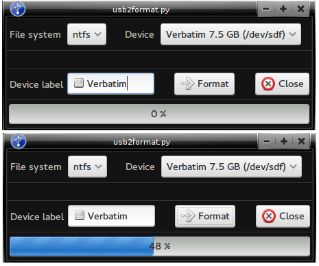

usb2format
==============
 

The purpose of this program is to ease the process and help you to format your usb flash drive. Windows has similar build-in program, while in GNU/Linux you have to do that with the terminal.. not anymore :)

## Requirements

* python2 
* mkfs
* python2-gobject
* webkitgtk, pywebkitgtk

## Archlinux support
Archlinux users can install the program directly from AUR, without the need to download it from here.

    yaourt -S usb2format-git

## Usage

Plug your usb flash drive and start the program. Adjust which flash drive have to formatted and select between "ntfs" or "fat" - fat 32.
The program will detect and list all your usb flash drives, sd cards and so on.
